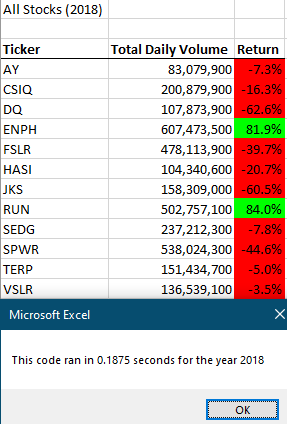

# stock-analysis


## Project Overview
This project is to refactor a VBA code which provides stock analysis to a ticker's Total Daily Volume and Overall Return per over each Calendar Year. The refactored code will improve VBA macro's run-time and re-usability/scalability.

## Results

### Refactoring Approach
- Run-time was improved by reducing nested loops and used stored array variables inside of the macro and then writing each array element into the workbook after the analysis is complete. In the original code, the code would write into the excel file for each iteration.
  - In the original code: 
     ```
     For i = 0 To 11
        ticker = tickers(i)
        ...
        For j = 2 to RowCount
        ... #analysis per "j" ...
        Next j
        ...
        #print results for each i
     Next i
     ```
     - Every row count (j) is iterated through each ticker (range of i), effectively running "i x j" number of rows
   - In the refactored code: 
      ```
      Dim tickerVolumes(12) As Long
      ...
      For tickerIndex = 0 To 11
        tickerVolumes(tickerIndex) = 0
      Next tickerIndex
      
      For i = 2 To RowCount
      ... #analysis per "i" and store in respective array element tickerVolumes(i)...
      Next i
      
      For i = 0 to 11
      ... # print tickerVolumes(i)
      next i    
      ```
      - the ticker array length is iterated first, and then the row analysis is iterated afterwards. This means instead of running "i x j" lines of code as seen in the original code, the refactored code runs "i + j" lines of code instead (in this case, "tickerIndex + i").
      
      
      
- Usability will be increased by allowing user input to specify the year of analysis, rather than having a hard-coded year in the VBA code.
  - In the original code:
    ```
    Range("A1").Value = "All Stocks (2017)"
    ...
    Worksheets("2017").Activate
    ...
    RowCount = Cells(Rows.Count, "A").End(xlUp).Row
    ...
    Worksheets("2017").Activate
    For j = 2 To RowCount
    ...
    Next J
    ```
  - The Refactored code:
    ```
    yearValue = InputBox("What year would you like to run the analysis on?")
    ...
    Range("A1").Value = "All Stocks (" + yearValue + ")"
    ...
    Worksheets("yearValue").Activate
    ...
    RowCount = Cells(Rows.Count, "A").End(xlUp).Row
    ...
    Worksheets("yearValue").Activate
    For j = 2 To RowCount
    ...
    Next J
    ```
### Run Times
- Run time and results of refactored code:
  -  <br/> 
  - Total Run Time: 
     - 2017: 0.1836 seconds  <br/>
     - 2018: 0.1875 seconds
- Run time and results of original code:
  -  <br/> 
  - Total Run Time: 
     - 2017: 0.9727 seconds <br/>
     - 2018: 0.9805 seconds <br/>

## Summary
- There is a detailed statement on the advantages and disadvantages of refactoring code in general (3 pt).
- There is a detailed statement on the advantages and disadvantages of the original and refactored VBA script (3 pt).
